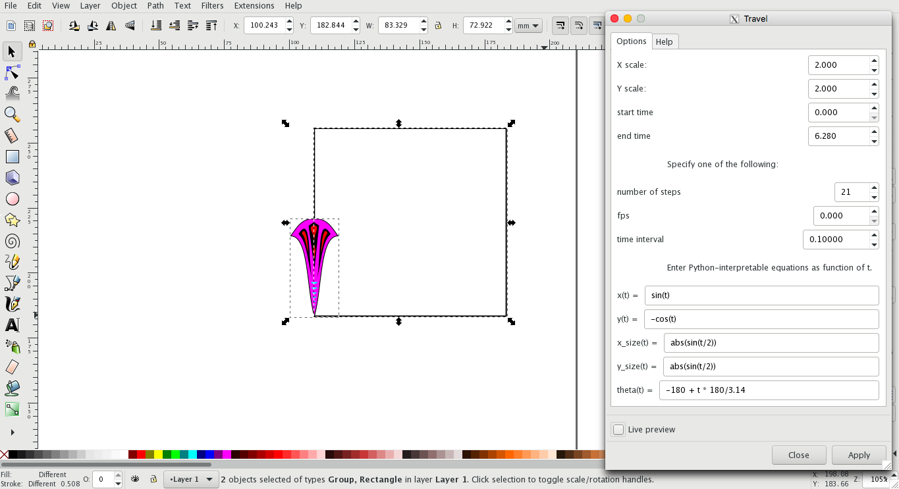

# Inkscape Travel Extension

## Copy an object along a precise parametric trajectory.

### (Scroll down for usage and installation instructions)

## Example 1:

 

## Result:

 

## Example 2 (Note: the rotation anchor is at the bottom of the plume):

## Result:

# Usage

Select two objects to use this extension: a rectangle and a template. The rectangle must be below the template, and the template must be a path or group of paths. If any path within the template has "arc" elements (e.g. ellipse/arc objects that have been converted to paths) you will encounter errors using the rotation function (sorry, unfortunately this isn't an easy fix).

Specify the timepoints at which your template will be copied using "start time", "end time", and either "number of steps", "fps", or "time interval". For example, if "start time" is 1, "end time" is 2, and "number of steps" is 6, then 6 copies of the template will be made, corresponding to times 1, 1.2, 1.4, 1.6, 1.8, and 2.0. If "number of steps" is zero, then "fps" can be used to specify frames per second, and if "fps" is also zero, "time interval" can be used to specify the interval between time points from "start time" to "end time".

Next, write in equations for x(t) and y(t) using Python syntax (e.g. x = t, y = t ** 2 yields part of a parabola). The units of x and y are relative to the size of the rectangle, for example, if X scale = 2, then one rectangle width corresponds to 2 units along the x-axis. If Y scale = 3, then one rectangle height corresponds to 3 units along the y-axis. The point (0, 0) corresponds to the lower left corner of the rectangle.

The equations for x_size and y_size are relative to the size of the object. E.g. if x_size(t) = 1, and y_size(t) = t, then the width of the copies will be identical to the template, but their height will increase with increasing t.

Finally, specify the rotation angle (theta) as a function of time. If the rotation anchor is set, the object will be rotated around it, otherwise it will be rotated around its center.

# Installation

Click "Clone or Download" and select "Download Zip".

Extract the zip file and copy the files travel.inx and travel.py into your Inkscape user extensions folder. On Mac OS X this is located in /Users/<my_username>/.config/inkscape/extensions. 

(Note, you might not be able to see the hidden .config folder automatically, so an easy way to access it is by selecting "Go" --> "Go to Folder" from the Finder menu and typing in "/Users/<my_username>/.config". For more help installing Inkscape extensions see [https://inkscape.org/en/gallery/%3Dextension/](https://inkscape.org/en/gallery/%3Dextension/).)

Once you've copied travel.inx and travel.py into your extensions folder, you should be able to access it within Inkscape under "Extensions" --> "Render" --> "Travel".
